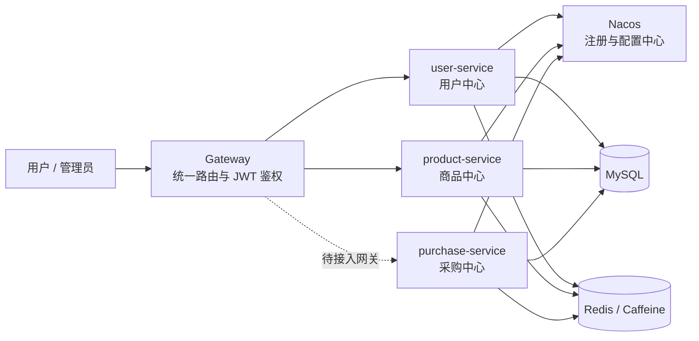
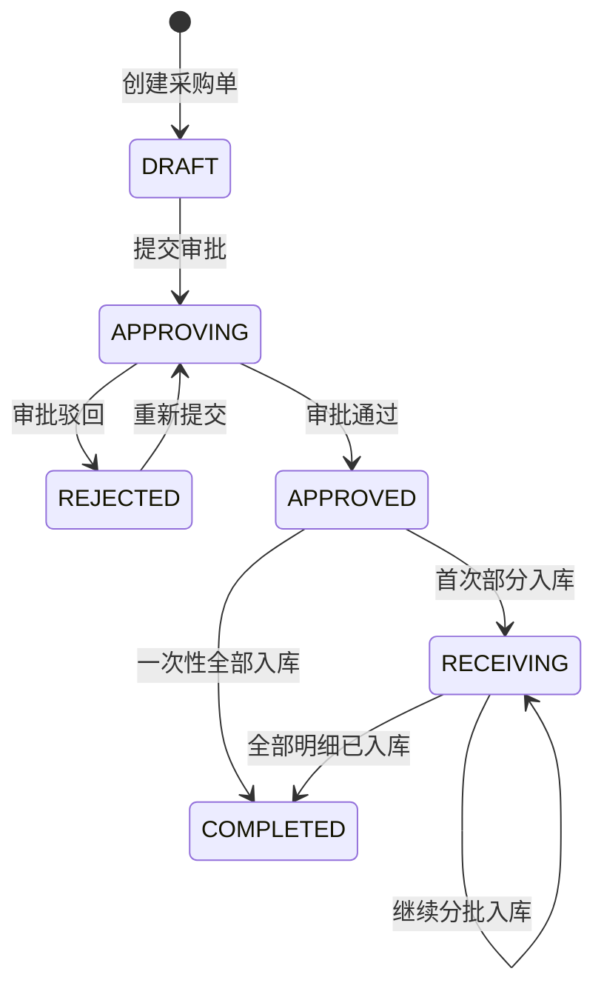

# 鲸选平台（Whale Platform）

> 面向企业采购与 B2C 电商场景的微服务练习项目，持续迭代中。

## 项目简介

鲸选平台将商品管理、用户中心和企业采购放在同一套服务体系中。当前已实现用户、商品及采购服务的主要后端能力，并通过网关、Nacos 和公共模块提供统一接入、服务发现及通用基础设施。

采购服务已形成以下业务闭环：

`供应商管理 → 创建采购单 → 提交审批 → 审批通过 → 分批入库 → 完成采购单`

订单、库存、支付、履约、营销和评价模块已预留 Maven 模块，但其中部分仍处于规划或开发阶段；本文不将其描述为已完成能力。

## 技术栈

- Java 17、Spring Boot 3.4
- Spring Cloud、Spring Cloud Alibaba、Nacos
- Spring Cloud Gateway、OpenFeign、Sentinel
- MyBatis-Plus、MySQL 8、Redis、Caffeine
- JWT、Springdoc OpenAPI / Swagger、Postman
- Maven、Lombok

## 模块说明

```text
whale-platform
├── gateway/                         # 网关路由、JWT 鉴权、限流配置
├── common-base/                     # 统一返回体、异常、分页、JWT 等基础能力
├── common-db/                       # Redis、Caffeine、MyBatis-Plus、对象存储等能力
├── ecommerce/
│   ├── user-service/                # 注册登录、验证码、地址、用户及操作日志
│   ├── product-service/             # 品牌、分类、SPU/SKU、商品上下架与文件上传
│   ├── order-service/               # 预留：订单域
│   ├── inventory-service/           # 预留：库存域
│   ├── payment-service/             # 预留：支付域
│   └── ...
├── procurement/
│   └── purchase-service/            # 供应商、采购单、采购明细、采购批次、入库记录
├── approval/                        # 预留：审批引擎
└── api-platform/                    # API 工程模板
```

## 架构概览



> 当前网关配置已包含用户、商品路由；采购服务运行在 `10040` 端口，接入网关前可直接访问。后续应增加 `/api/purchase/**` 路由和 OpenAPI 聚合配置。

## 已实现功能

### 用户中心

- 用户注册、登录、验证码校验与 JWT 登录态
- 用户资料、收货地址管理
- 登录日志、用户操作日志

### 商品中心

- 品牌和商品分类树管理
- SPU / SKU、规格属性和批量 SKU 生成
- 商品创建、编辑、分页查询、详情、逻辑删除、上下架
- 服务端中转上传文件至对象存储

### 采购中心

- 供应商新增、编辑、启用/禁用、详情和分页查询
- 创建采购单：校验供应商状态、计算采购总额、保存供应商快照及采购明细
- 采购单状态流转：`DRAFT → APPROVING → APPROVED → RECEIVING → COMPLETED`
- 审批驳回后可再次提交；审批信息和驳回原因会保留在采购单中
- 按采购明细分批入库，限制入库数量不能超过待入库数量
- 入库业务单号幂等校验，并以条件更新降低并发重复入库风险
- 采购批次号生成和采购批次分页查询

## 采购流程



## 本地启动

### 1. 准备环境

- JDK 17
- Maven 3.9+
- MySQL 8+
- Redis 7+
- Nacos 2.x

项目的开发环境配置位于各服务的 `bootstrap-dev.yaml` 中。启动前请将 Nacos、MySQL、Redis 等地址和账号替换为自己的本地环境配置，建议通过环境变量或 Nacos 管理敏感配置，不要提交密码、AccessKey/Secret 等信息。

采购服务新增的批次表和索引脚本位于：

```text
procurement/purchase-service/src/main/resources/db/purchase-service-schema.sql
```

该脚本是采购服务的增量脚本，前提是已有 `supplier`、`purchase_order`、`purchase_item`、`inbound_record` 等基础表。

### 2. 构建公共模块和服务

在项目根目录执行：

```bash
mvn clean install -DskipTests
```

也可以仅构建采购服务及其依赖：

```bash
mvn -pl procurement/purchase-service -am clean package -DskipTests
```

### 3. 启动顺序

1. MySQL、Redis、Nacos
2. `user-service`（默认 `10020`）
3. `product-service`（默认 `10030`）
4. `purchase-service`（默认 `10040`）
5. `gateway`（默认 `10010`）

例如启动采购服务：

```bash
mvn -pl procurement/purchase-service spring-boot:run
```

## 采购服务接口

服务地址：`http://localhost:10040`  
接口文档：`http://localhost:10040/swagger-ui/index.html`

| 功能 | 方法与路径 |
| --- | --- |
| 新增供应商 | `POST /supplier` |
| 编辑供应商 | `PUT /supplier/{id}` |
| 启用/禁用供应商 | `PUT /supplier/{id}/status?enabled=true` |
| 查询供应商 | `GET /supplier/{id}`、`GET /supplier/page` |
| 创建采购单 | `POST /purchase-order/createOrder` |
| 查询采购单详情 | `GET /purchase-order/{id}` |
| 提交审批 | `PUT /purchase-order/{id}/submit` |
| 审批通过 | `PUT /purchase-order/{id}/approve?processId={processId}` |
| 审批驳回 | `PUT /purchase-order/{id}/reject` |
| 采购明细入库 | `POST /inbound-record/purchase-order/{orderId}` |
| 查询采购批次 | `GET /purchase-batch/page` |

创建采购单示例：

```json
{
  "supplierId": 1,
  "remark": "9 月补货采购",
  "items": [
    {
      "skuId": 10001,
      "quantity": 20,
      "price": 99.90,
      "remark": "白色，256G"
    }
  ]
}
```

入库示例：

```json
{
  "purchaseItemId": 1,
  "quantity": 10,
  "bizNo": "IN-20260902-0001",
  "remark": "第一批到货"
}
```

网关会向下游服务透传 `X-User-Id`。为便于本地联调，采购服务在该请求头缺失时暂以用户 `1` 作为默认值；生产环境应移除默认值并强制在网关完成认证。

## 后续计划

- 完成订单、库存、支付、履约与售后闭环
- 在采购入库完成后通过库存服务接口更新可用库存
- 将采购审批对接实际审批引擎，而非当前的人工状态接口
- 为采购单号、入库业务单号补充数据库唯一索引和集成测试
- 接入消息队列、可靠消息和补偿任务，处理跨服务最终一致性
- 为关键链路补充单元测试、接口测试、压测与 Docker Compose 部署

## 许可证

本项目当前未声明开源许可证；如需对外发布，请补充合适的 License 文件。
